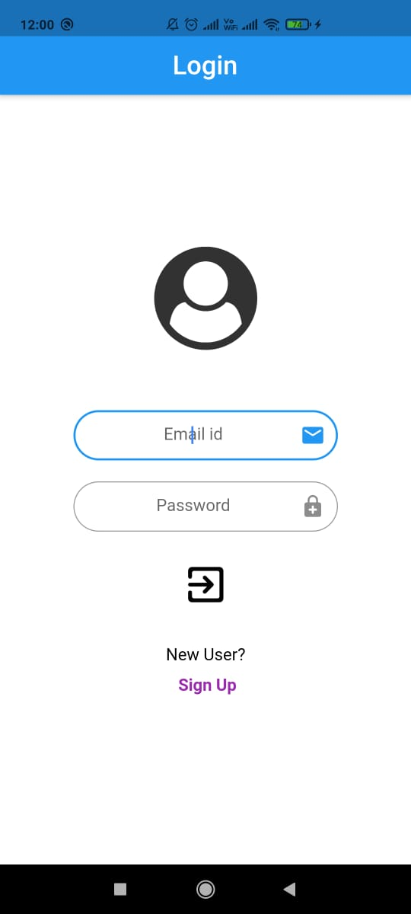
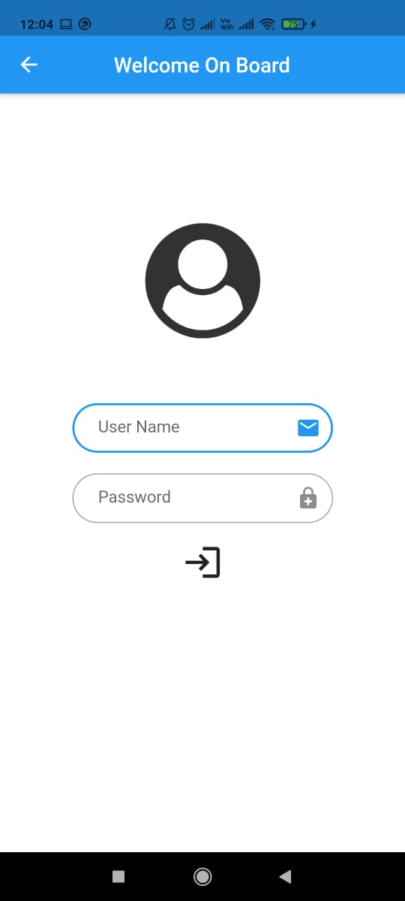
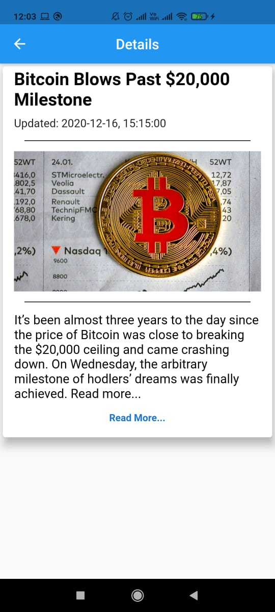
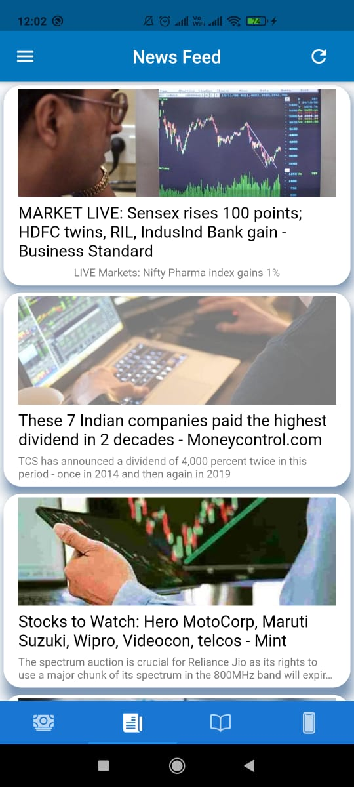

# News and Cryptocurrency App 
Built using Flutter and Firebase. Used API to get data about cryptocurrency and news on 4 topics.

# Screenshots of Application
<pre align="center">   
</pre>
<pre align="center">   
</pre>
<pre align="center">   
</pre>
<pre align="center">   
</pre>
<pre align="center"> 
</pre>
