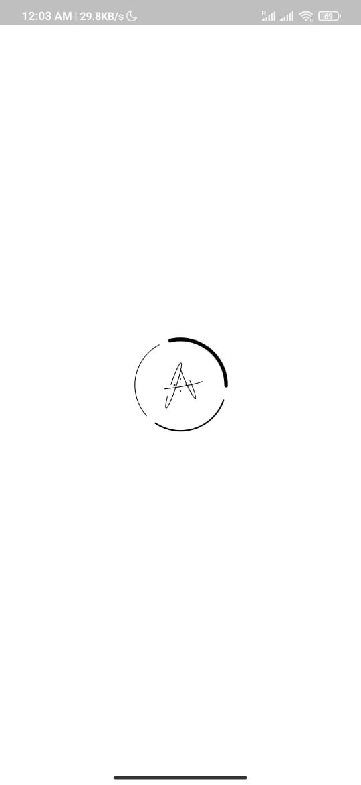
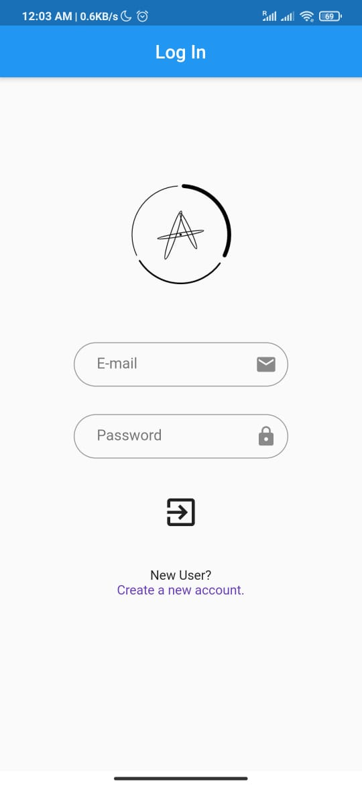
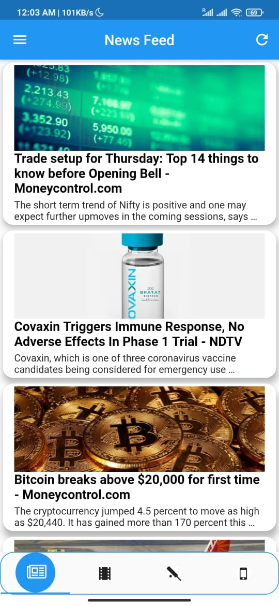
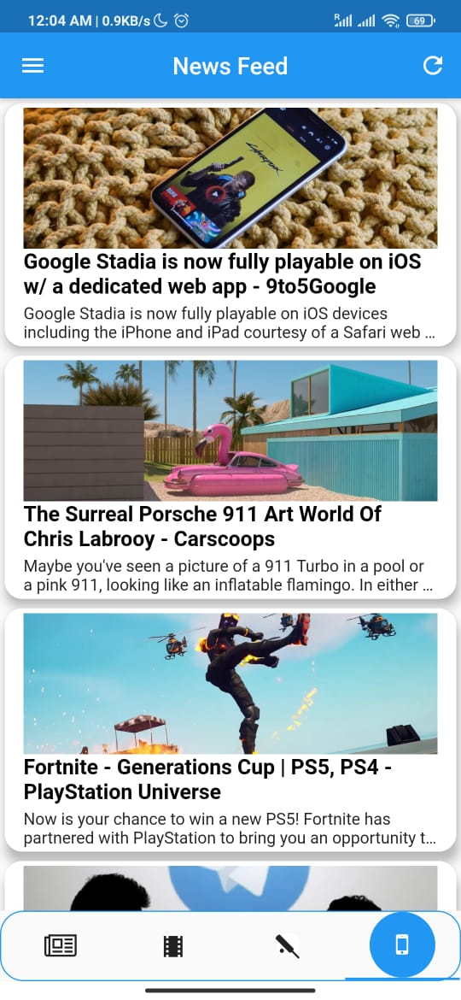

# News_app
Built using Flutter and Firebase.
Used APIs to get current stock market data and News data.
Showing rise and fall of crypto currency with their price.
Latest news about four major topics with beautiful UI.

# Screen Shots

<pre align="center">
          
</pre>

<pre align="center">
          
</pre>

<pre align="center">
          
</pre>

<pre align="center">
          
</pre>
